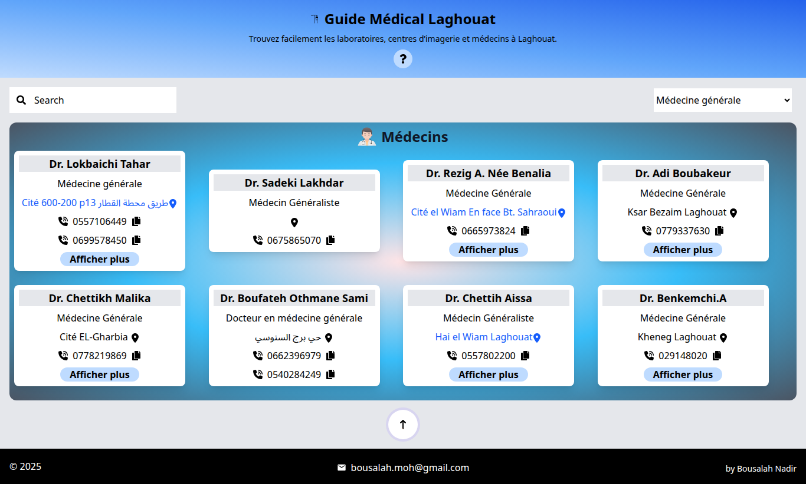

# Guide medical Laghouat
## Table of contents

- [Overview](#overview)
  - [Discription](#the-challenge)
  - [Screenshot](#screenshot)
  - [Links](#links)
- [My process](#my-process)
  - [Built with](#built-with)
- [Author](#author)

## Overview

### Discription

Guide Medical Laghouat is a web application designed to provide quick and easy access to information about medical facilities and healthcare professionals in laghouat. The platform aims to help residents find hospitals, clinics, and doctors based on location, specialty, and available services.

Key Features

-Browse a comprehensive list of local clinics, and medical centers.
-View detailed profiles of doctors, including their specialties and contact information.
-Search and filter based on medical specialty.
-Mobile-friendly, responsive design for easy access on all devices.

### Screenshot

  ## Desktop
  

  ## Mobile
  

### Links

- Live Site URL: [live site](https://guidemedicallaghouat.netlify.app/)

## My process

### Built with

- TailwindCSS
- React
- Flexbox

## Author

- GitHub - [@Medido1](https://github.com/Medido1)

